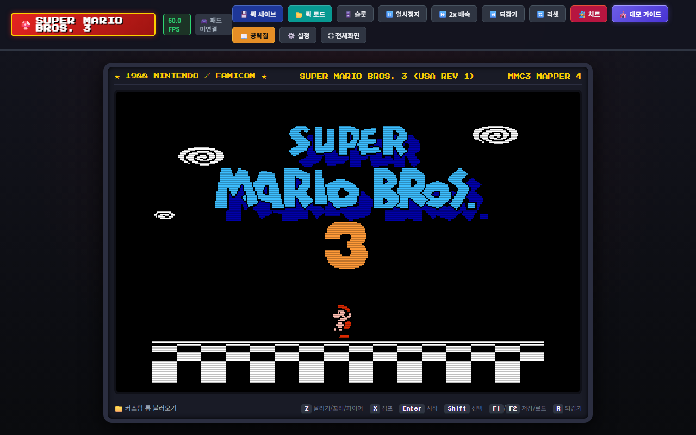

# 🍄 Super Mario Bros. 3 (슈퍼마리오 브라더스 3) - 100% Web Port

> 1988년 닌텐도 패미컴(NES) 불후의 명작 **슈퍼마리오 브라더스 3**를 브라우저에서 100% 완벽하게 즐길 수 있는 고성능 웹 애플리케이션 포트입니다.


[](https://jeiel85.github.io/supermario3/)

### 🎮 [웹에서 지금 바로 플레이하기 (Live Demo)](https://jeiel85.github.io/supermario3/)



---

## 🌟 주요 특징 (Key Features)

- **100% 원작 완전 재현 (WebAssembly Libretro FCEUMM)**
  - 8개 월드, 전 스테이지, 모든 보스전 수록
  - 수퍼나뭇잎(너구리 꼬리/비행), 타누키 수트(지장보살 변신), 개구리 수트, 해머 수트(등껍질 가드 & 해머 투척), P-날개, 쿠리보의 신발 완벽 구현
  - MMC3 (Mapper 4) 래스터 IRQ 스캔라인 분할(하단 HUD) 및 2A03 APU 5채널 음향 100% 일치
  - 로컬 오프라인 즉시 구동 (외부 네트워크 의존성 없음)

- **멀티 입력 시스템 지원**
  - **키보드 커스텀 매핑**: 방향키/WASD, Z/X 점프 및 대시, 터보 키(Q, E) 지원
  - **HTML5 Gamepad API**: Xbox, PS4/PS5, Switch Pro Controller 등 연결 시 자동 인식 및 듀얼 럼블 진동 피드백
  - **모바일/태블릿 가상 터치패드**: 8방향 반응형 D-패드 및 햅틱 진동 피드백 내장

- **고급 편의 기능**
  - **비주얼 세이브 슬롯 (IndexedDB)**: 6개 슬롯에 스크린샷 썸네일과 함께 진행 상태 영구 보존 및 `.state` 파일 내보내기/가져오기 지원
  - **Game Genie 치트 엔진**: 무한 목숨, 무한 비행 P-날개, 각종 수트 고정, 시간 무제한 및 커스텀 코드 입력 지원
  - **인게임 비기 공략집**: 3대 마법의 피리(Warp Whistle) 획득 비밀 위치 및 황금 보물 코인선 출현 공식 수록
  - **레트로 디스플레이**: CRT 스캔라인 필터 및 브라운관 곡면 효과(Curvature)

---

## 🕹️ 조작법 (Controls)

| 버튼 | 키보드 키 | 설명 |
| :--- | :--- | :--- |
| **D-Pad** | `방향키` 또는 `W, A, S, D` | 이동 / 쭈그리기 |
| **B 버튼** | `Z` 또는 `J` | 달리기 / 꼬리치기 / 파이어 / 등껍질 잡기 |
| **A 버튼** | `X` 또는 `K` | 점프 / 수영 / 비행 |
| **터보 B / A** | `Q` / `E` | 연속 발사 / 고속 점프 |
| **SELECT** | `Shift` 또는 `C` | 아이템 인벤토리 열기 |
| **START** | `Enter` 또는 `Space` | 게임 시작 / 일시정지 |
| **퀵 세이브 / 로드** | `F1` / `F2` | 즉시 저장 / 즉시 불러오기 |
| **되감기 (Rewind)** | `R` (누르고 있기) | 과거 상태로 되감기 |
| **배속 가속** | `Tab` | 2.0x 고속 모드 |
| **전체화면** | `F` | 아케이드 풀스크린 모드 |

---

## 🚀 빠른 시작 (Getting Started)

### 설치 및 로컬 실행

```bash
# 의존성 설치
npm install

# 개발 서버 실행
npm run dev

# 프로덕션 빌드
npm run build

# 빌드 결과물 미리보기
npm run preview
```

브라우저에서 `http://localhost:3000` 으로 접속하여 플레이할 수 있습니다.

---

## 📜 라이선스 (License)

이 프로젝트의 웹 프론트엔드 코드는 MIT 라이선스를 따릅니다.
에뮬레이션 코어는 Libretro FCEUMM GPL-2.0 라이선스를 따릅니다.
Super Mario Bros. 3는 Nintendo의 등록 상표입니다.
